<div align="center">

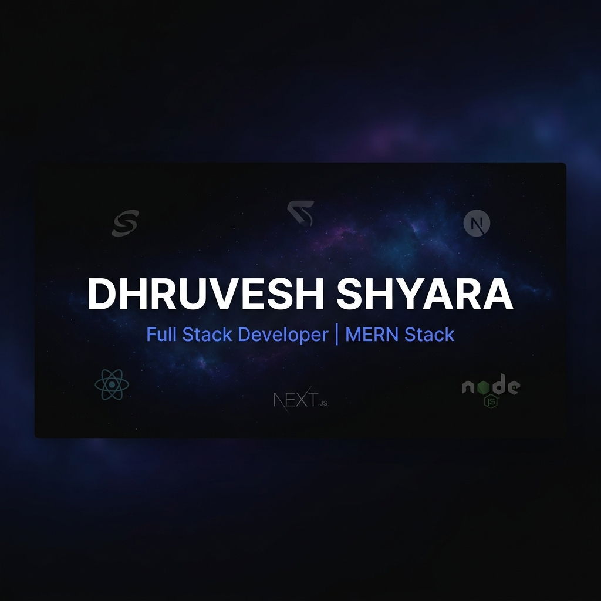

# 🚀 Dhruvesh Shyara — Portfolio

### *"Learning, Living, and Leveling Up."*

[](https://dhruveshshyara.in)
[](https://nextjs.org/)
[](https://react.dev/)
[](https://www.framer.com/motion/)
[](https://vercel.com)

<br/>

A **cinematic, high-performance** developer portfolio built with **Next.js 16**, **React 19**, and **Framer Motion** — featuring immersive animations, a **VS Code-inspired command palette**, an **admin dashboard**, custom analytics tracking, and a fully responsive design.

<br/>

</div>

---

## 📑 Table of Contents

- [📸 Preview](#-preview)
- [✨ Highlights](#-highlights)
- [🏗️ Architecture](#️-architecture)
- [🧭 Application Flow](#-application-flow)
- [📄 Pages & Routes](#-pages--routes)
- [🧩 Component Architecture](#-component-architecture)
- [🛠️ Tech Stack](#️-tech-stack)
- [📂 Project Structure](#-project-structure)
- [🎨 Design System](#-design-system)
- [⚡ Key Features](#-key-features)
- [📊 Admin Dashboard](#-admin-dashboard)
- [🔧 Getting Started](#-getting-started)
- [📦 Environment Variables](#-environment-variables)
- [🚀 Deployment](#-deployment)
- [📈 Performance](#-performance)
- [🤝 Contact](#-contact)

---

## 📸 Preview

<div align="center">

### 🎬 Hero Section — Cinematic Landing Experience

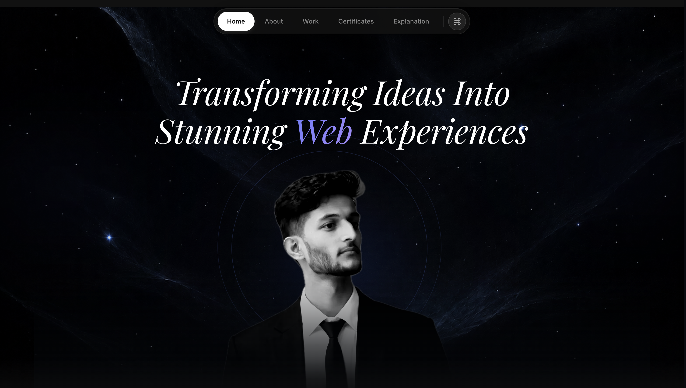

<br/><br/>

### 💼 Projects Page — Filterable Project Showcase

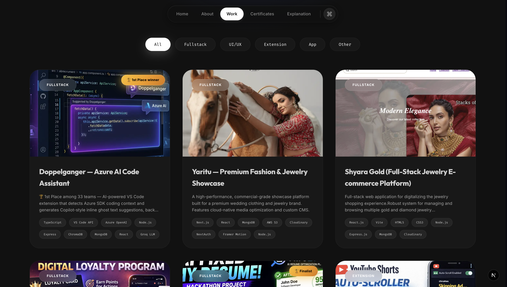

<br/><br/>

### ⏳ Preloader — Bold Entry Animation

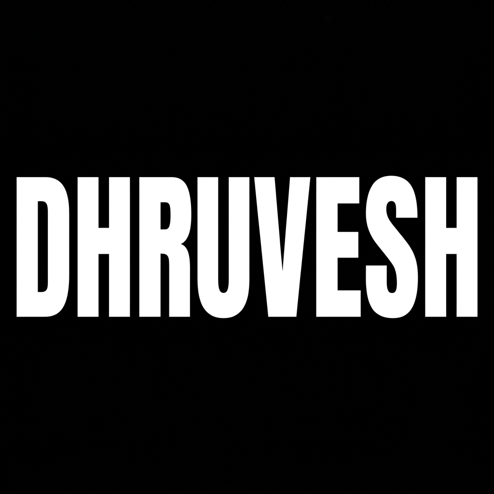

<br/><br/>

### 👤 About Me Page — Education Timeline & Bio

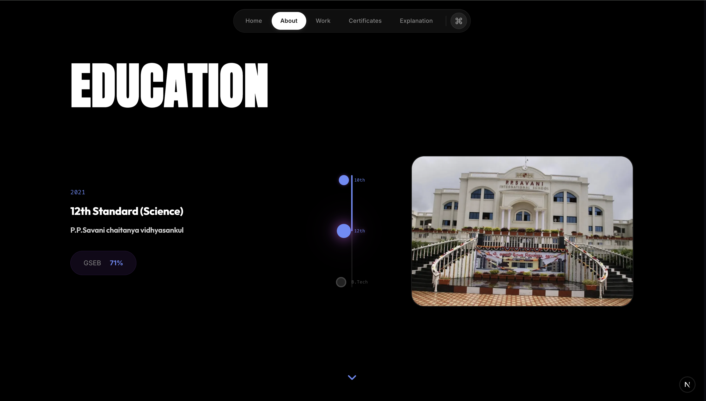

<br/><br/>

### 📜 Certificates Page — Achievement Showcase

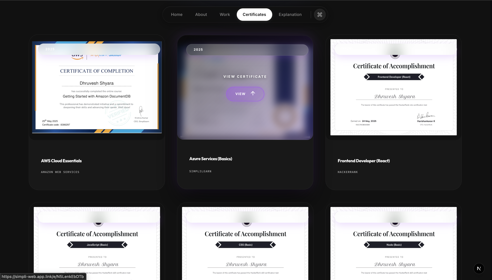

<br/><br/>

### ⌘ Command Palette — VS Code-Style Search

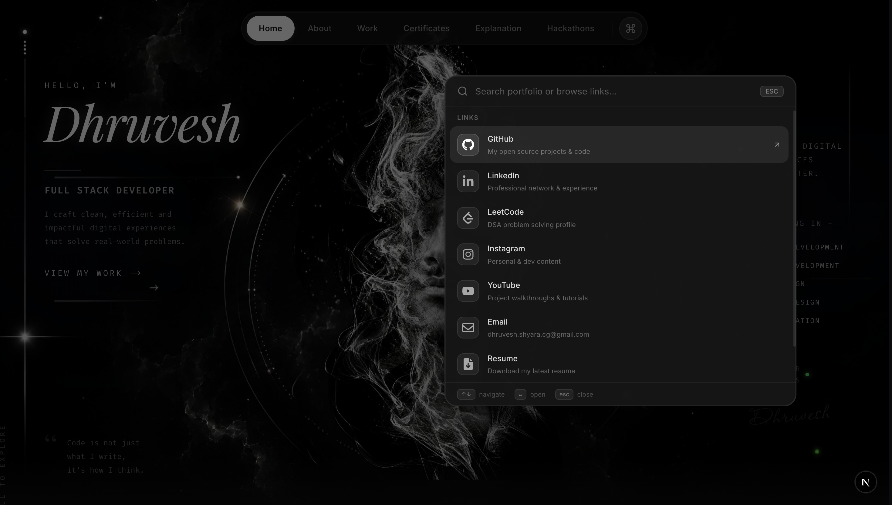

<br/><br/>

### 📱 Mobile Responsive — Seamless on Every Device

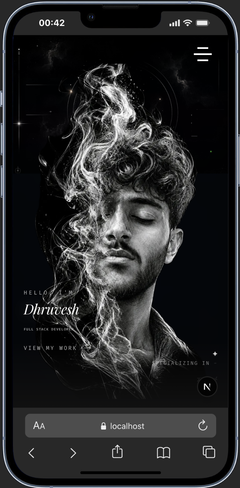

</div>

---

## ✨ Highlights

<br/>

| Feature | Description |
|---------|-------------|
| 🎬 **Cinematic Hero** | Full-screen hero with nebula effects, animated star canvas, and concentric ring animations |
| ⌘ **Command Palette** | VS Code-style `Cmd+K` search with fuzzy matching across all portfolio content |
| 🧠 **Admin Dashboard** | Full CMS for managing projects, skills, certificates, and site settings |
| 📊 **Custom Analytics** | Built-in analytics tracking with page views, visitor data, and dashboard visualization |
| 🎭 **Page Transitions** | Smooth page transitions with Framer Motion AnimatePresence |
| 🌑 **Dark Mode** | Premium dark theme with glassmorphism effects and gradient accents |
| 👁️ **Interactive Footer** | Animated avatar with mouse-tracking eyes that follow cursor position |
| 📱 **Fully Responsive** | Mobile-first design with hamburger navigation and optimized touch interactions |
| ⚡ **Preloader** | Custom animated preloader for premium first-load experience |
| 🔐 **Auth System** | NextAuth.js based admin authentication with bcrypt password hashing |

---

## 🏗️ Architecture

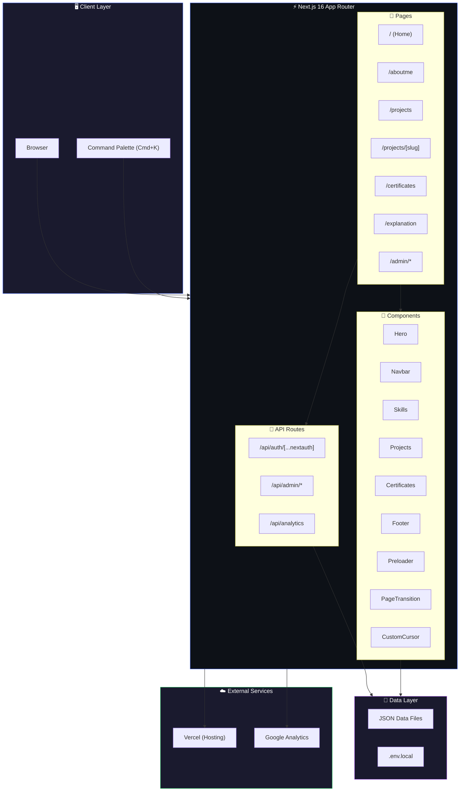

---

## 🧭 Application Flow

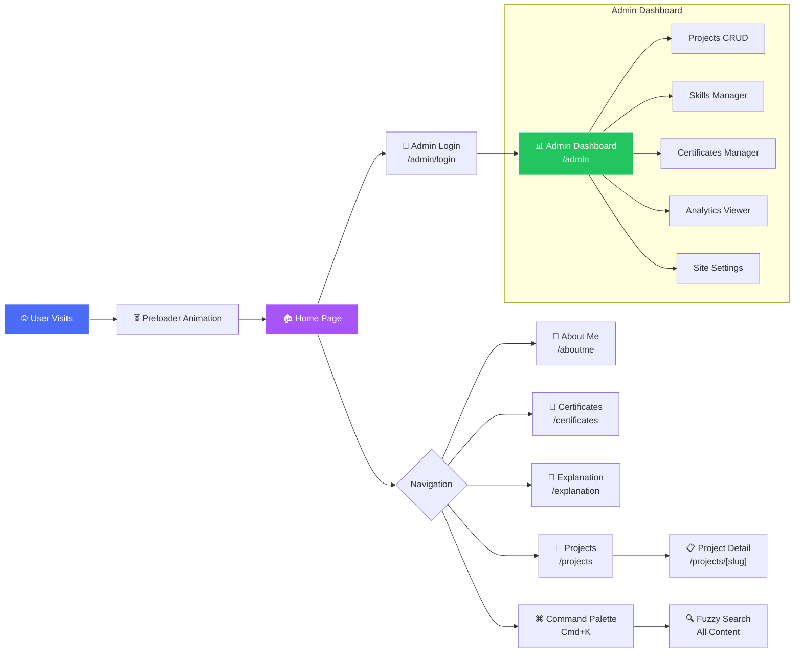

---

## 📄 Pages & Routes


### Public Pages

| Route | Page | Description |
|-------|------|-------------|
| `/` | **Home** | Hero section, About preview, Skills showcase, Projects grid, Certificates carousel |
| `/aboutme` | **About Me** | Detailed education timeline, journey, and personal bio |
| `/projects` | **All Projects** | Full project showcase with filtering and detailed cards |
| `/projects/[slug]` | **Project Detail** | Individual project page with features, architecture, challenges, and YouTube demos |
| `/certificates` | **Certificates** | All certifications with verification links |
| `/explanation` | **Explanation** | Behind-the-scenes technical explanation of the portfolio |

### Admin Pages

| Route | Page | Description |
|-------|------|-------------|
| `/admin/login` | **Login** | Secure authentication with NextAuth.js |
| `/admin` | **Dashboard** | Overview analytics and quick actions |
| `/admin/projects` | **Projects Manager** | Full CRUD for project entries |
| `/admin/skills` | **Skills Manager** | Manage skill categories and proficiency levels |
| `/admin/certificates` | **Certificates Manager** | Add/edit/delete certifications |
| `/admin/analytics` | **Analytics** | Page view data and visitor insights |
| `/admin/settings` | **Settings** | Site-wide configuration |
| `/admin/about` | **About Editor** | Edit personal info and bio |
| `/admin/experience` | **Experience** | Manage work experience entries |
| `/admin/media` | **Media Manager** | Upload and manage media assets |
| `/admin/content` | **Content Editor** | Edit page content |
| `/admin/seo` | **SEO Settings** | Meta tags and SEO configuration |
| `/admin/appearance` | **Appearance** | Theme and visual settings |
| `/admin/messages` | **Messages** | View contact form submissions |

---

## 🧩 Component Architecture

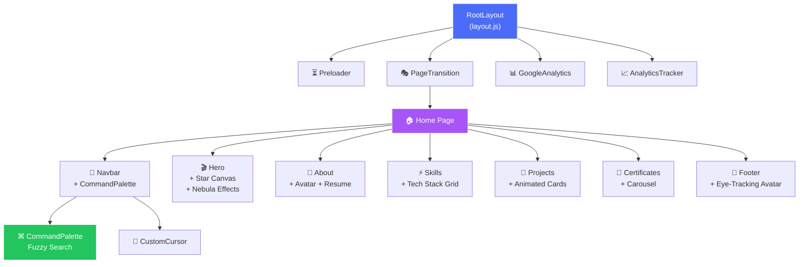

---

## 🛠️ Tech Stack

<div align="center">
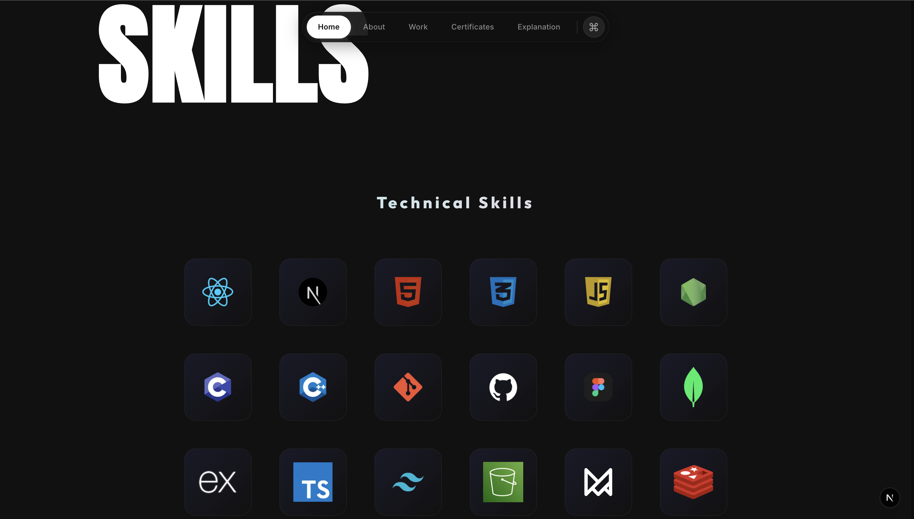
</div>

### Core Framework

| Technology | Version | Purpose |
|------------|---------|---------|
| **Next.js** | 16.1.4 | React framework with App Router, SSR, and API routes |
| **React** | 19.2.3 | UI component library |
| **React DOM** | 19.2.3 | DOM rendering |

### Animation & UI

| Technology | Purpose |
|------------|---------|
| **Framer Motion** 12.29 | Page transitions, scroll animations, hover effects |
| **Vanilla CSS** | 89KB+ custom design system with CSS variables |
| **Google Fonts** | Fira Code, Anton, Passions Conflict, Playfair Display, Inter, Outfit |

### Backend & Auth

| Technology | Purpose |
|------------|---------|
| **NextAuth.js** 4.24 | Admin authentication with credential provider |
| **bcryptjs** 3.0 | Password hashing for secure auth |
| **Next.js API Routes** | RESTful endpoints for admin CRUD operations |

### Utilities

| Technology | Purpose |
|------------|---------|
| **react-icons** | Icon library for consistent iconography |
| **react-dropzone** | File upload in admin dashboard |
| **react-hot-toast** | Toast notifications for user feedback |
| **slugify** | URL-safe slug generation for projects |
| **uuid** | Unique ID generation for data entries |

### DevOps & Deployment

| Technology | Purpose |
|------------|---------|
| **Vercel** | Production hosting with edge functions |
| **ESLint** | Code quality and linting |
| **Git** | Version control |

---

## 📂 Project Structure

```
dhruveshshyara_portfolio/
├── public/                          # Static assets
│   ├── certificates/                # Certificate images
│   ├── png/                         # Portfolio images, logos, avatars
│   ├── projects/                    # Project screenshots
│   ├── resumes/                     # Resume PDF files
│   ├── svg/                         # SVG icons and illustrations
│   └── preloader.html               # Custom preloader template
│
├── src/
│   ├── app/                         # Next.js App Router
│   │   ├── layout.js                # Root layout (fonts, metadata, analytics)
│   │   ├── page.js                  # Home page composition
│   │   ├── globals.css              # Complete design system (89KB)
│   │   │
│   │   ├── aboutme/page.jsx         # About Me page (education timeline)
│   │   ├── projects/
│   │   │   ├── page.jsx             # Projects listing page
│   │   │   └── [slug]/page.jsx      # Dynamic project detail pages
│   │   ├── certificates/page.jsx    # Certificates page
│   │   ├── explanation/page.jsx     # Portfolio explanation page
│   │   │
│   │   ├── admin/                   # Admin Dashboard
│   │   │   ├── layout.jsx           # Admin layout wrapper
│   │   │   ├── page.jsx             # Dashboard home
│   │   │   ├── admin.css            # Admin-specific styles
│   │   │   ├── login/               # Auth login page
│   │   │   ├── projects/            # Project CRUD
│   │   │   ├── skills/              # Skills management
│   │   │   ├── certificates/        # Certificate management
│   │   │   ├── analytics/           # Analytics dashboard
│   │   │   ├── settings/            # Site settings
│   │   │   ├── about/               # About editor
│   │   │   ├── experience/          # Experience editor
│   │   │   ├── media/               # Media manager
│   │   │   ├── content/             # Content editor
│   │   │   ├── seo/                 # SEO settings
│   │   │   ├── appearance/          # Theme settings
│   │   │   └── messages/            # Contact messages
│   │   │
│   │   └── api/                     # API Routes
│   │       ├── auth/[...nextauth]/  # NextAuth.js handler
│   │       ├── admin/               # Admin CRUD endpoints
│   │       │   ├── about/
│   │       │   ├── analytics/
│   │       │   ├── certificates/
│   │       │   ├── dashboard/
│   │       │   ├── experience/
│   │       │   ├── projects/
│   │       │   ├── settings/
│   │       │   └── skills/
│   │       └── analytics/           # Public analytics endpoint
│   │
│   ├── components/                  # Reusable UI Components
│   │   ├── Hero.jsx                 # Cinematic hero with star canvas
│   │   ├── Navbar.jsx               # Navigation + hamburger menu
│   │   ├── CommandPalette.jsx       # VS Code-style Cmd+K search
│   │   ├── About.jsx                # About section with avatar
│   │   ├── Skills.jsx               # Tech stack grid
│   │   ├── Projects.jsx             # Project cards with animations
│   │   ├── Certificates.jsx         # Certificate showcase
│   │   ├── Footer.jsx               # Interactive footer with tracking eyes
│   │   ├── Preloader.jsx            # Loading animation
│   │   ├── PageTransition.jsx       # Framer Motion page transitions
│   │   ├── CustomCursor.jsx         # Custom cursor effect
│   │   ├── GoogleAnalytics.jsx      # GA4 integration
│   │   ├── AnalyticsTracker.jsx     # Custom analytics tracking
│   │   ├── YouTubeEmbed.jsx         # YouTube video player
│   │   └── admin/                   # Admin-specific components
│   │
│   ├── data/                        # JSON Data Store
│   │   ├── about.json               # Personal info, social links
│   │   ├── projects.json            # All project entries (52KB)
│   │   ├── skills.json              # Skills with categories & levels
│   │   ├── certificates.json        # Certifications data
│   │   ├── analytics.json           # Analytics data storage
│   │   ├── settings.json            # Site configuration
│   │   ├── commandPaletteData.js    # Search index for Cmd+K
│   │   └── projectsData.js          # Project helper utilities
│   │
│   ├── lib/                         # Utility Libraries
│   │   ├── data.js                  # Data read/write helpers
│   │   └── imageUtils.js            # Image processing utilities
│   │
│   └── pages/                       # Pages Router (API compat)
│       └── api/                     # Additional API routes
│
├── .env.local                       # Environment variables
├── next.config.mjs                  # Next.js configuration
├── package.json                     # Dependencies & scripts
├── eslint.config.mjs                # Linting configuration
└── jsconfig.json                    # Path aliases (@/)
```

---

## 🎨 Design System

### Typography

| Font | Variable | Usage |
|------|----------|-------|
| **Fira Code** | `--font-fira-code` | Code blocks, monospace text, developer aesthetic |
| **Anton** | `--font-anton` | Large hero headings, impact text |
| **Passions Conflict** | `--font-passions-conflict` | Decorative cursive accents |
| **Playfair Display** | `--font-playfair` | Elegant italic text, quotes |
| **Inter** | `--font-inter` | Body text, general UI |
| **Outfit** | `--font-outfit` | Headings, navigation, buttons |

### Color Palette

```
Primary Blue    → #4a6cf7   (Accents, links, CTAs)
Light Purple    → var(--color-light-purple)   (Gradients, glows)
Dark Mode BG    → #0b0b0b / #070607   (Backgrounds)
White           → #ffffff   (Text on dark)
Gray Text       → #b3b3b3   (Secondary text)
Border          → var(--tech-stack-box-border-color)
```

### Visual Effects

- **Nebula/Smoke effects** — Radial gradients with blur for cosmic background
- **Glassmorphism** — Backdrop blur with semi-transparent backgrounds
- **Micro-animations** — Framer Motion `whileInView`, `whileHover` transitions
- **Concentric rings** — Animated orbital rings around hero image
- **Mouse-tracking eyes** — Pupil positions calculated from cursor coordinates
- **Gradient borders** — Linear gradient borders on interactive elements

---

## ⚡ Key Features

### 🎬 Cinematic Hero Section

The hero features a full-screen immersive experience with:
- **Star Particles Canvas** — HTML5 Canvas with 80 twinkling stars using `requestAnimationFrame`
- **Cosmic Nebula Effects** — Three layered radial gradients (left, right, center)
- **Concentric Rings** — CSS-animated orbital rings around the profile photo
- **Bottom Cinematic Fade** — Gradient overlay for seamless section transition

### ⌘ Command Palette (Cmd+K)


VS Code-inspired command palette with:
- **Fuzzy search** across all portfolio content (projects, skills, pages)
- **Social links** browsable when no query is entered
- **Keyboard navigation** — Arrow keys, Enter to select, Escape to close
- **Auto-scroll** active items into view
- **Grouped results** with type badges (page, project, section, info)

### 👁️ Interactive Footer Avatar

<div align="center">
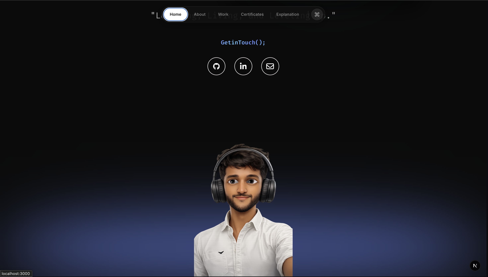
</div>

Animated avatar in the footer with:
- **Mouse-tracking eyes** — Pupils follow cursor position in real-time
- **Math-based movement** — Position calculated as fraction of viewport dimensions
- **Smooth transitions** — CSS transform with calculated `translate()` values

### 📊 Custom Analytics

<div align="center">
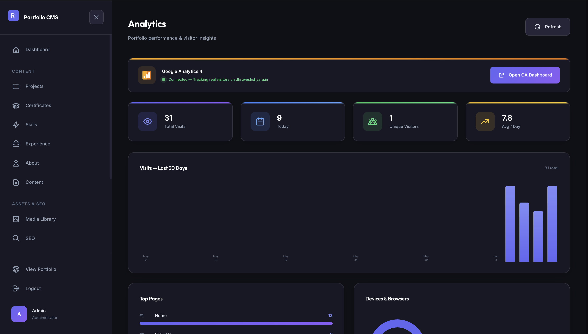
</div>

Built-in analytics system independent of Google Analytics:
- **Page view tracking** per route
- **Visitor data collection** with timestamps
- **Admin dashboard visualization** with summary metrics
- **JSON-based storage** for lightweight data persistence

---

## 📊 Admin Dashboard

<div align="center">
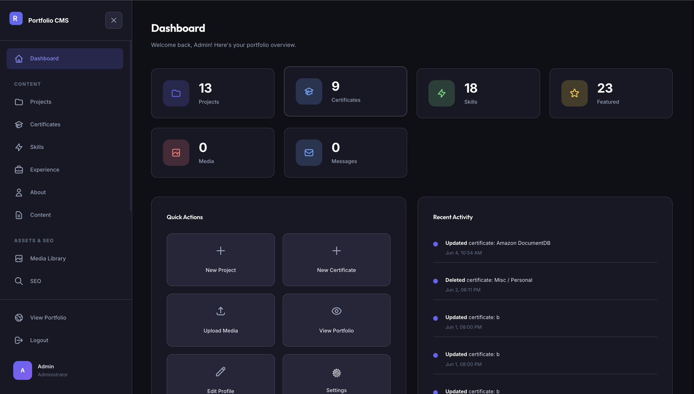
</div>

The portfolio includes a full-featured admin CMS accessible at `/admin`:

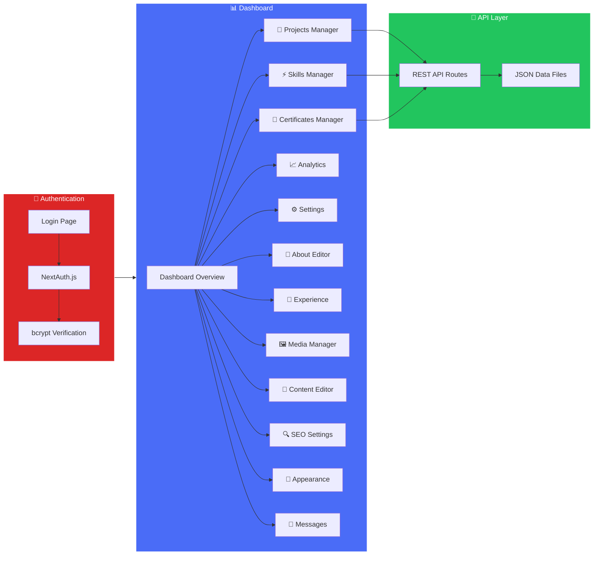

### Admin Features


- **Full CRUD operations** for all content types
- **JSON file-based data persistence** — no external database required
- **Media upload** with react-dropzone integration
- **Real-time preview** of content changes
- **Role-based access** with NextAuth.js session management
- **Toast notifications** for operation feedback

---

## 🔧 Getting Started

### Prerequisites

- **Node.js** 18+ 
- **npm** 9+ (or yarn/pnpm)

### Installation

```bash
# 1. Clone the repository
git clone https://github.com/Dhruvesh1611/dhruveshshyara_portfolio.git

# 2. Navigate to the project directory
cd dhruveshshyara_portfolio

# 3. Install dependencies
npm install

# 4. Set up environment variables
cp .env.example .env.local
# Edit .env.local with your credentials (see Environment Variables section)

# 5. Start the development server
npm run dev
```

Open [http://localhost:3000](http://localhost:3000) to view the portfolio.

### Available Scripts

| Command | Description |
|---------|-------------|
| `npm run dev` | Start development server with hot reload |
| `npm run build` | Create optimized production build |
| `npm start` | Start production server |
| `npm run lint` | Run ESLint for code quality |

---

## 📦 Environment Variables

Create a `.env.local` file in the root directory:

```env
# NextAuth.js Configuration
NEXTAUTH_SECRET=your_nextauth_secret_here
NEXTAUTH_URL=http://localhost:3000

# Google Analytics (Optional)
NEXT_PUBLIC_GA_MEASUREMENT_ID=G-XXXXXXXXXX
```

---

## 🚀 Deployment

This portfolio is deployed on **Vercel** with automatic deployments on every push to `main`.

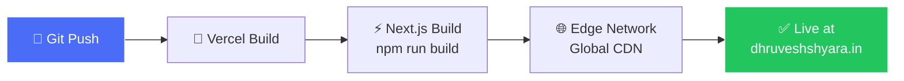

### Deploy to Vercel

[](https://vercel.com/new/clone?repository-url=https://github.com/Dhruvesh1611/dhruveshshyara_portfolio)

1. Push your code to GitHub
2. Import the repository on [Vercel](https://vercel.com)
3. Add environment variables in Vercel Dashboard → Settings → Environment Variables
4. Deploy! 🎉

---

## 📈 Performance
The portfolio is optimized for performance with:

- **Next.js Image Optimization** — Automatic resizing, lazy loading, and WebP conversion
- **Font Optimization** — Self-hosted Google Fonts via `next/font` (zero layout shift)
- **Code Splitting** — Automatic route-based code splitting
- **CSS Optimization** — Single CSS file with efficient selectors
- **Framer Motion** — `viewport={{ once: true }}` to animate only on first view
- **Priority Loading** — Hero image marked with `priority` for LCP optimization

---

## 📁 Featured Projects

<div align="center">

</div>

| # | Project | Tech Stack | Links |
|---|---------|------------|-------|
| 🏆 | **Doppelganger** — Azure AI Code Assistant | TypeScript, VS Code API, Azure OpenAI, ChromaDB | [GitHub](https://github.com/Dhruvesh1611/Doppelganger-March-2026-Eklavya) · [Live](https://azure-ai-code-assistant.vercel.app/) |
| 👗 | **Yaritu** — Premium Fashion Showcase | Next.js, MongoDB, AWS S3, Cloudinary | [GitHub](https://github.com/Dhruvesh1611/yaritu) · [Live](https://yaritu.vercel.app) |
| 💍 | **Shyara Gold** — Jewelry E-commerce | React, Node.js, Express, MongoDB | [GitHub](https://github.com/codinggita/shyara_gold) · [Live](https://shyara-gold.netlify.app/) |
| 🎨 | **Tattoo Studio** — Membership Platform | React, Node.js, JWT, MongoDB | [GitHub](https://github.com/Dhruvesh1611/tattoos_website) · [Live](https://tattoos-dreamers-studio.onrender.com/) |
| 📄 | **HireLens** — AI Resume Optimizer | Next.js, TypeScript, Gemini API, Redis | [GitHub](https://github.com/Dhruvesh1611/Team-Velox-AI-RESUME-OPTIMIZER) · [Live](https://hirelens.dev) |
| 🔄 | **YT Shorts Auto-Scroller** | JavaScript, Chrome Extension, Manifest V3 | [GitHub](https://github.com/Dhruvesh1611/auto-scroll-extension) |

---

## 🤝 Contact

<div align="center">

| Platform | Link |
|----------|------|
| 🌐 **Portfolio** | [dhruveshshyara.in](https://dhruveshshyara.in) |
| 💼 **LinkedIn** | [linkedin.com/in/dhruveshshyara](https://linkedin.com/in/dhruveshshyara) |
| 🐙 **GitHub** | [github.com/Dhruvesh1611](https://github.com/Dhruvesh1611) |
| 📧 **Email** | [dhruvesh.shyara.cg@gmail.com](mailto:dhruvesh.shyara.cg@gmail.com) |
| 📱 **Phone** | +91-9327595429 |

</div>

---

<div align="center">

**Design & Built by Dhruvesh Shyara © 2026**

⭐ If you liked this portfolio, consider giving it a star!

</div>

